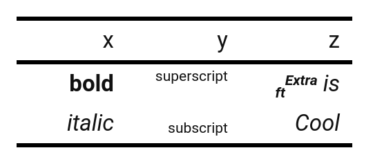
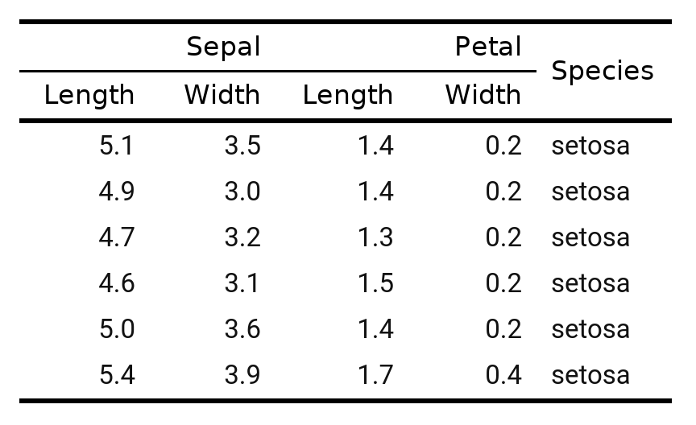

<!-- README.md is generated from README.Rmd. Please edit that file -->

# ftExtra

<!-- badges: start -->

[](https://github.com/atusy/ftExtra/actions)
[](https://CRAN.R-project.org/package=ftExtra)


<!-- badges: end -->

The ftExtra package provides helper functions for the flextable package:

-   `colformat_md` parses markdown texts in columns
-   `span_header` makes multi-level headers
-   and more!

## Installation

### from CRAN

``` r
install.packages("ftExtra")
```

### from GitHub

``` r
options(repos = c(atusy = 'https://atusy.r-universe.dev', getOption("repos")))
install.packages("ftExtra")
```

## Example

``` r
library(ftExtra)
```

### Parse markdown texts

``` r
data.frame(
  x = c("**bold**", "*italic*"),
  y = c("^superscript^", "~subscript~"),
  z = c("***~ft~^Extra^** is*", "*Cool*"),
  stringsAsFactors = FALSE
) %>%
  as_flextable() %>%
  colformat_md()
```



### Span headers

``` r
iris %>%
  head %>%
  as_flextable() %>%
  span_header()
```



### Group rows

``` r
library(dplyr, warn.conflicts = FALSE)
iris %>%
  group_by(Species) %>%
  slice(1:2) %>%
  as_flextable()
```


